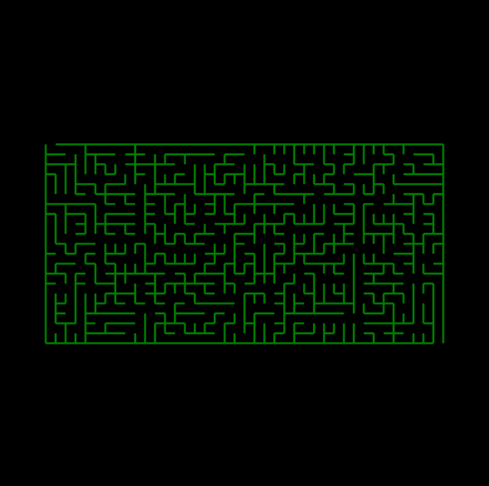
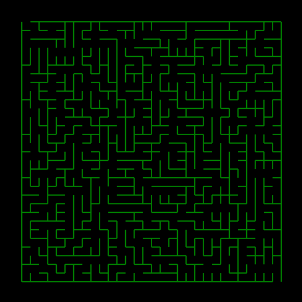
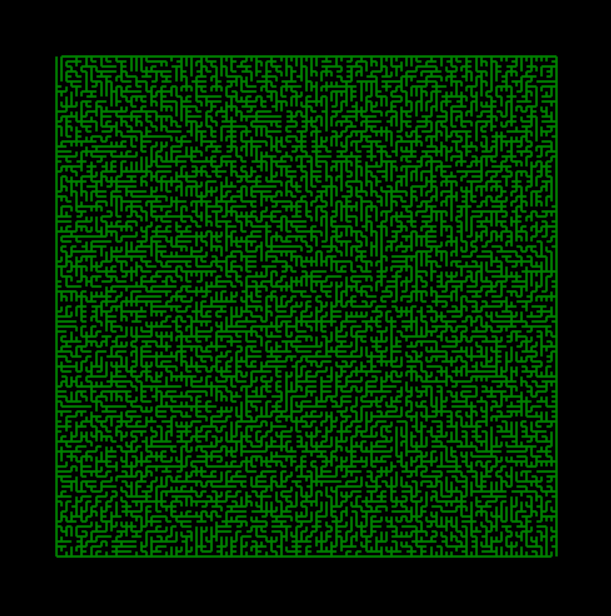

# Visualized Random Maze Generation

Randomized maze generation utilizing various algorithmic approaches, visualised in **TKinter**.

## The Method

The first iteration of the maze generator utilises **_Prim's algorithm_**, a _greedy_ algorithm for creating minimum-spanning trees (MSTs) in a weighted graph,
albeit slightly tweaked.  
Starting from a perfect grid, during each iteration, since we're looking for **randomised** generations each time, instead of attaching weights to walls, one is randomly selected to be removed. Since Prim's algorithm is guarenteed to produce an MST with no loops, the maze is solvable from any cell on the grid.

## Examples

| **20×40**                             | **30×30**                             | **100×100**                               |
| ------------------------------------- | ------------------------------------- | ----------------------------------------- |
|  |  |  |

## Usage

```bash
python maze.py                                    # Default 20x20 maze
python maze.py --rows 30 --cols 30                # Custom grid size
python maze.py --maze-window-percentage 70        # Maze covers 70% of the window
python maze.py --help                             # Show all options
```

| Flag                       | Type | Default | Description                                  |
| -------------------------- | ---- | ------- | -------------------------------------------- |
| `--rows`                   | int  | 20      | Defines the number of rows in the grid       |
| `--cols`                   | int  | 20      | Defines the number of columns in the grid    |
| `--maze-window-percentage` | int  | 85      | Percentage of the window covered by the maze |

Requires Python 3 with Tkinter (included in most Python installations).
